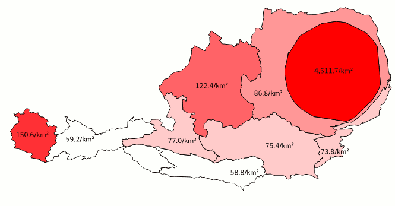

QGIS3 cartogram3 plugin
=======================

This plugin creates continous cartograms (a.k.a. anamorphic maps) from polygon layers.

It is a port of the [cartogram plugin](https://plugins.qgis.org/plugins/cartogram/) of [Dagbladet Information](https://github.com/informeren/qgis-cartogram) and [Carson Farmer](https://github.com/carsonfarmer/cartogram) to QGIS 3, Python 3 and PyQt5. It also features a few improvements, such as parallel processing (using `multiprocessing`), the option to select multiple variables to batch-produce cartograms, and the possibility to use a maximum total error threshold as a stop condition in addition to the number of iterations.

As its successors, this plugin implements the algorithm proposed by: 

> Dougenik, J. A, N. R. Chrisman, and D. R. Niemeyer. 1985. "[An algorithm to construct continuous cartograms.](http://www.tandfonline.com/doi/abs/10.1111/j.0033-0124.1985.00075.x)" Professional Geographer 37:75-81 

More detailed documention is to be written, in the meantime please refer to the [QGIS 2-Plugin’s documentation](https://github.com/informeren/qgis-cartogram/blob/develop/README.md).

Usage
-----

* If you have not done it, install the plugin from QGIS’ plugin manager.

* Open a polygon dataset with an absolute count[1)](#footnote-1) of a certain variable, such as human population. If you do not have an own dataset immediately available, add the supplied sample data set from the plugin’s menu.  
  In this example we use a choropleth map of the population of Austria’s NUTS2 regions. Austria is an excellent example, as the only major city of the country and its metropolitan area are home to roughly a third of the country’s inhabitants. As you can see, the map is styled with graduated symbols representing the respective region’s population density. We also added labels showing the population density.  
  

* Fire up the cartogram3 plugin. Select which layer you want to compute a cartogram of, and choose one or more attributes for batch processing (Pro tip: at [austromorph](https://austromorph.space) we use this feature to create animation frames). Then, define stop conditions: since the algorithm is iterative, the results get gradually better with every repetition. The more iterations, the better; but also: the more iterations, the longer the computation time. We recommend an absolute minimum of 10 iterations. If the requested quality is met earlier, i.e. the average areal error of the cartogram is smaller than the set value, the computation stops earlier.  
  

* Depending on the detail of your dataset and on your computer’s power, it takes from seconds to hours until you receive your results. The progress is shown in the QGIS message bar, also you can always click the cancel button to stop the computation early. The algorithm iterates over every point &times; every polygon, and thus scales extremely poorly. Consider simplifying your input dataset beforehand.  
  

1) </a>Why an absolute count of a variable? Quote from the [worldmapper.org FAQ](http://www.worldmapper.org/faq.html):

> Q. Why don't you have a map of population density or births per thousand? 
> A. The maps are best understood as pie charts where the segment of the pie is reshaped to look like a country.  Then the area of that country is adjusted according to the proportion of the world total of a variable that is found there.  Just as a pie chart would.  As such, we can only map counts or totals.  We cannot map rates because they are not additive, that is to say that they do not add up to a meaningful total.  To return to the pie chart analogy, you would not draw a pie chart of population density but one of total population.

License
-------

#### QGIS3 cartogram3
Copyright (C) 2017 Christoph Fink

#### QGIS Cartogram – a plugin for creating cartograms from polygon layers 
Copyright (C) 2015  Morten Wulff  
Copyright (C) 2013  Carson Farmer

This program is free software; you can redistribute it and/or modify it under the terms of the GNU General Public License as published by the Free Software Foundation; either version 2 of the License, or (at your option) any later version.

This program is distributed in the hope that it will be useful, but WITHOUT ANY WARRANTY; without even the implied warranty of MERCHANTABILITY or FITNESS FOR A PARTICULAR PURPOSE.  See the GNU General Public License for more details.

You should have received a copy of the GNU General Public License along with this program; if not, write to the Free Software Foundation, Inc., 51 Franklin Street, Fifth Floor, Boston, MA 02110-1301 USA.

Sample data
-----------

The supplied sample dataset is combined from two data sources:

* Administrative boundaries: [(c) 2013 EuroGeographics](http://ec.europa.eu/eurostat/web/gisco/geodata/reference-data/administrative-units-statistical-units/nuts#nuts13)
* Population numbers: [(c) 2017 Statistik Austria](http://www.statistik.at/web_de/statistiken/menschen_und_gesellschaft/bevoelkerung/bevoelkerungsstand_und_veraenderung/bevoelkerung_zu_jahres-_quartalsanfang/index.html)

